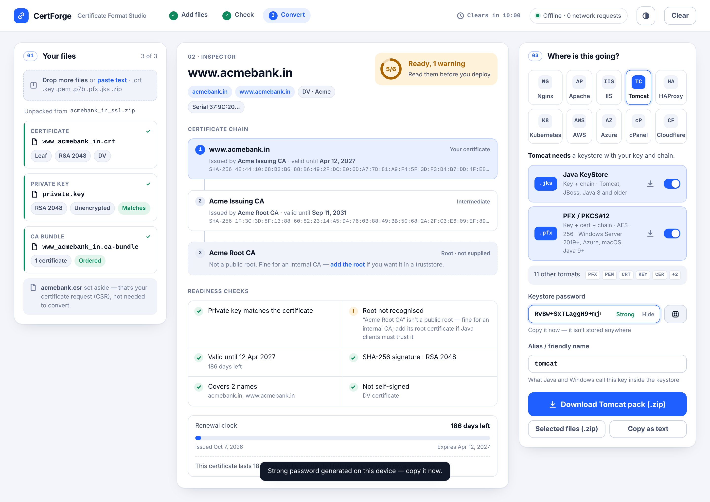
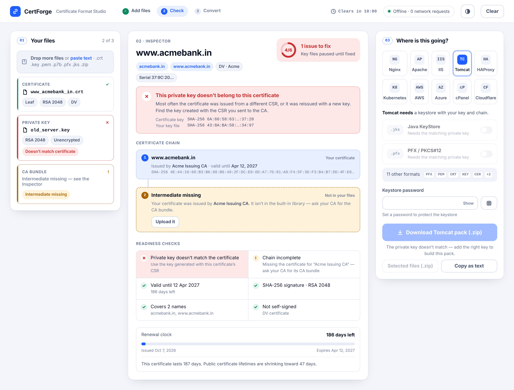
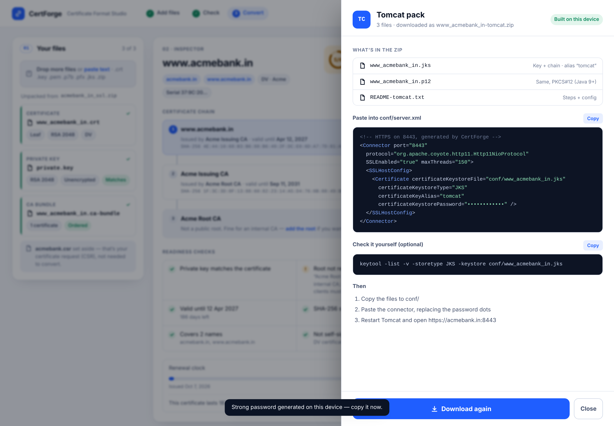

# CertForge — Certificate Format Studio

Turn a certificate, private key and CA bundle — in any format — into every format a server needs. Then get a ready-to-paste config for that server.

**One HTML file. Works offline. Nothing is uploaded, nothing is saved.**



## Use it

1. Download [`dist/certforge.html`](dist/certforge.html) (or the file attached to the latest release).
2. Double-click it. It opens in any modern browser — Chrome, Edge, Firefox or Safari.
3. Drop in your files: the zip from your CA, loose `.crt` / `.key` / `.pem` files, a `.p7b`, an existing `.pfx` or `.jks`, or paste the text.
4. Check the Inspector, pick your server, download.

No install, no internet, no account.

## What it does

**Reads anything:** PEM (single or many blocks), DER, PKCS#7 (`.p7b`), PKCS#12 (`.pfx` / `.p12`, modern AES and legacy 3DES/RC2), Java KeyStore (`.jks`), encrypted keys (PKCS#8 and traditional OpenSSL), and CA zip deliveries. CSRs are recognised and set aside.

**Checks before converting:**
- the private key matches the certificate;
- the chain is complete, in order, and every signature verifies;
- expiry, signature algorithm, key size and SANs.

A missing intermediate from a major CA is filled in from a built-in, offline library of 58 current intermediates. Each one is verified against the 121 Mozilla root certificates.

**Writes 13 formats:**

| Format | File | Contains |
| --- | --- | --- |
| PFX / PKCS#12 | `.pfx` | Key + certificate + chain, AES-256 (Windows Server 2019+, Azure, macOS, Java 9+) |
| PFX, legacy | `-legacy.pfx` | Same, Triple-DES (Windows Server 2012–2016, Azure App Service) |
| Java KeyStore | `.jks` | Key + chain (Tomcat, JBoss, Java 8) |
| Full chain PEM | `.fullchain.pem` | Certificate + intermediates (Nginx, HAProxy) |
| Certificate PEM | `.crt` | Your certificate |
| CA bundle PEM | `.ca-bundle.crt` | Intermediates only |
| Private key | `.key` | PKCS#8, unencrypted |
| Private key, encrypted | `.enc.key` | PKCS#8, AES-256 |
| Private key, traditional | `.traditional.key` | `BEGIN RSA/EC PRIVATE KEY` |
| Combined PEM | `.combined.pem` | Key + certificate + chain |
| DER | `.cer` | Your certificate, binary |
| PKCS#7 | `.p7b` | Certificate + chain, no key |
| Java truststore | `.truststore.jks` | CA certificates only |

**10 server packs** are zips holding exactly the files a server needs, plus a README with the config already filled in: Nginx, Apache, IIS, Tomcat, HAProxy, Kubernetes (ready-to-apply TLS Secret), AWS ACM, Azure, cPanel and Cloudflare.

| Problems are explained, not just flagged | Each server pack comes with its config |
| --- | --- |
|  |  |

## Privacy and security

- The file sets a Content-Security-Policy that blocks **every** network request. The header shows a live count (it stays at 0).
- Nothing is written to cookies, localStorage or anywhere else. Closing the tab, pressing **Clear**, or 10 idle minutes wipes everything.
- Passwords you generate are made with the browser's secure random generator.
- Each build prints the SHA-256 of `certforge.html` (also in `dist/certforge.html.sha256`). Compare it to make sure your copy hasn't been changed.

## Known limits

- **Java and non-English passwords:** Java can't open PKCS#12 files whose password contains non-English characters, even files OpenSSL made. The app warns about this. JKS files are not affected.
- **Rare PFX encryption schemes:** a few PFX files from very old systems use schemes the browser library can't read. The app shows a one-line OpenSSL command to re-save them.
- **JCEKS keystores** must be converted to JKS or PKCS#12 with `keytool` first.

## Develop

```bash
npm install
npm run build            # → dist/certforge.html
npm test                 # round-trip tests: every output checked with OpenSSL and keytool
npm run test:browser     # drives the real UI in Chromium (needs playwright)
npm run build:library    # rebuild the intermediate/root library from library/
```

The tests need `openssl` and a JDK (`keytool`) on the PATH.

### Refreshing the intermediate library

`library/sources.txt` lists the official CA download URLs and `library/intermediates/` holds the downloaded certificates. `library/roots.pem` holds the Mozilla root set (from the `ca-certificates` package). To refresh:

1. Download any new intermediates into `library/intermediates/` as PEM files.
2. Run `npm run build:library`. It keeps only CA certificates that are currently valid and whose signature verifies up to a Mozilla root.
3. Run `npm run build`.

### White-label build

```bash
BRAND=my-brand.json npm run build
```

`my-brand.json` can set any of the following:
- `name`
- `tagline`
- `automationUrl` (shows an "Automate renewals →" link in the renewal clock)
- `automationLabel`
- `footer`

### Layout

```
src/lib/      parsing, checks and writers (runs in browsers and Node)
  ingest.js     anything in → certificates, keys, locked items, notes
  model.js      key + leaf + ordered chain, missing/extra pieces
  checks.js     readiness checks
  outputs.js    13 formats and 10 server packs
  pkcs12.js jks.js pkcs7.js keys.js zip.js cert.js verify.js
src/ui/       the interface (plain DOM, no framework)
scripts/      build and library generator
test/         round-trip and browser tests
library/      intermediate certificates, Mozilla roots, source URLs
```

See [DESIGN.md](DESIGN.md) for the design system.

### Continuous integration

`docs/ci-workflow.yml` runs the test suite and checks that `dist/` is up to date on every push. To switch it on, move it to `.github/workflows/test.yml`. Pushing workflow files needs a token with the `workflow` permission.
